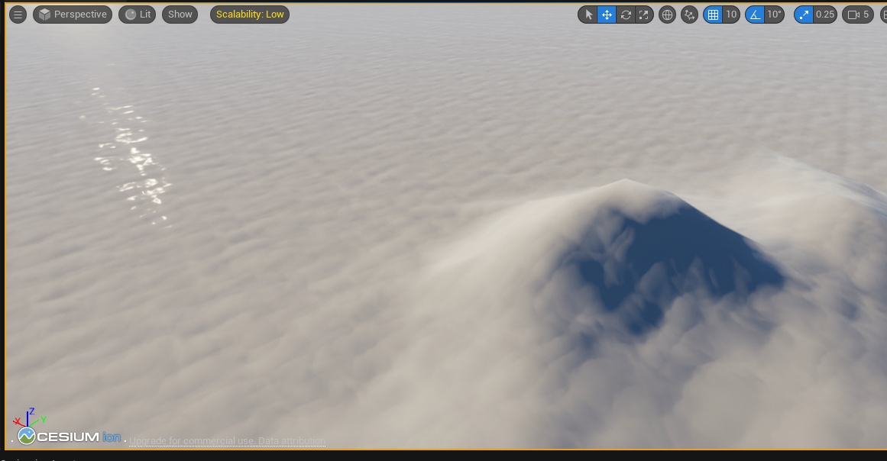

# Buoyancy
> - Cesium for Unreal Plugin: 지형 생성
> - Widget Blueprint: 수위 조절 가능한 User Interface 생성
 
# Cesium World Map
- BuoyancyMap 생성
- Cesium SunSky 생성
- Cesium World Terrain 생성
- Cesium Georeference 태평양 좌표

  | Latitude          | Longitude         | Height |
  |-------------------|-------------------|--------|
  | 37.24050871822413 | 131.8675245491631 | 1000.0 |
- Cesium World Terrain actor Enable Water Mask 체크
  - 추가 설정 없이 물  생성.
  
