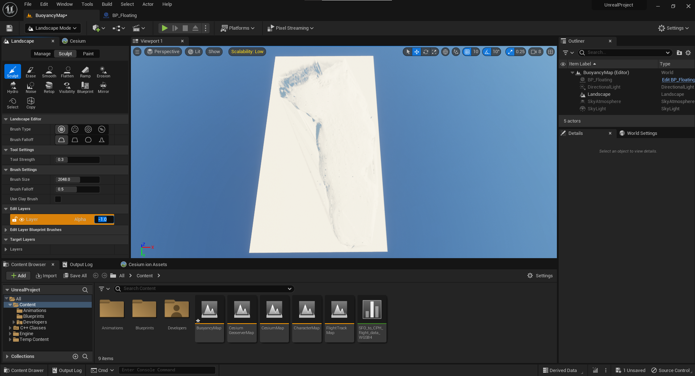

# Buoyancy
> - Cesium for Unreal Plugin: 지형 생성
>   - Cesuim에 water plugin 적용이 안됨
> - Widget Blueprint: 수위 조절 가능한 User Interface 생성
 
# Cesium World Map
- BuoyancyMap 생성
- Cesium SunSky 생성
- Cesium World Terrain 생성
- Cesium Georeference 태평양 좌표

  | Latitude          | Longitude         | Height |
  |-------------------|-------------------|--------|
  | 37.24050871822413 | 131.8675245491631 | 1000.0 |
- Cesium World Terrain actor Enable Water Mask 체크
  - 추가 설정 없이 물  생성.
  
  - > 해저 지형은 구현되지 않아 파도처럼 보이는 평평한 바닥만 형성됨   
buoyancy 객체를 띄워도 평평한 바닥 위에 떠있음   
Cesium for Unreal 플러그인은 Cesium을 Landscape로 변경 불가
  - > DEM 파일(*.png / *.raw)을 Landscape로 import 후 Water plugin 사용

# Water Plugin
> Built-in plugin   
> Landscape를 통해 지형 생성 후 Water Body 액터를 추가

#  Environment
- 차례대로 추가
1. Directional Light - Location 초기화
2. Sky Atmosphere - Location 초기화
3. Sky Light - Real Time 체크

# Import Landscape
> Water plugin 내부에 설치되어 있음.
- 에디터 상단에 Selection Mode 드롭박스를 클릭 후 Landscape Mode 선택
- **Import from File** 선택 후 **Enable Edit Layers** 체크
- Heightmap File 선택 후 Mesh 설정
- Heightmap File(*.png)과 Import 결과   


- 더 낮아야 하는 부위가 높아져있으니 좌측의 Alpha 값을 -1로 설정   

- 다시 Selection Mode로 변경 후 Water Body Lake 액터 추가 후 Auto Activate 체크
  - Landscape 모양이 변경된다면 Water Body Lake의 Details 패널 Terrain 탭 Affects Landscape 해제
  - Water Zone은 Landscape 외부에 물이 있도록 위치 조절
  - WaterBodyLake Spline Component 조절로 면적 조절
    - 결과   

- Water Body Lake collision 확인 - [WaterBodyCollision](#water-body-collision)

# Buoyancy Component
- Actor 상속 Blueprint 생성 BP_Floating
## Static Mesh
- Boat.obj Import 후 BP_Floating Static Mesh 설정
- Static Mesh를 Default Scene Root로 드래그
- Details 패널에서 Simulate Physics 체크
- Mass 설정으로 부력 조절 가능
## Buoyancy Component
- Buoyancy Component 추가
- Auto Activate 체크
- Details > Buoyancy > Buoyancy Data Pontoons 추가를 위한 소켓 설정
  - Pontoon(부교): Buoyancy Component에서 실제로 물에 뜨는 부분
  - Root Component가 Box Collision 등일 때 최대 2개, Static Mech일 때 최대 4개 사용 가능
  - **단, 소켓 사용 시 Static Mesh가 Root Component더라도 2개까지 사용 가능**
  - 소켓을 사용하지 않고 직접 좌표를 지정하여 적용 가능
- 소켓 사용하지 않고 좌표 2개만 사용
  - 1500, 440, 700, Radius: 350
  - -600, 440, 700, Radius: 350
  - **지정한 좌표에 반지름 350cm인 부표를 물에 띄운다고 생각**
- 결과   

  > cmd 창에 r.Water.DebugBuoyancy 1 입력 시 시뮬레이션하는 동안 Buoyancy Component 확인이 가능
  
# Water Body Collision
> Water Plugin 활성화 시 자동으로 추가되지만 추가되지 않고 에러가 나는 경우가 많음   
> **Config > DefaultEngine.ini**
> ```ini
> [/Script/Engine.CollisionProfile]
> +Profiles=(Name="WaterBodyCollision",CollisionEnabled=QueryOnly,bCanModify=False,ObjectTypeName="",CustomResponses=((Channel="WorldDynamic",Response=ECR_Overlap),(Channel="Pawn",Response=ECR_Overlap),(Channel="Visibility",Response=ECR_Ignore),(Channel="Camera",Response=ECR_Ignore),(Channel="PhysicsBody",Response=ECR_Overlap),(Channel="Vehicle",Response=ECR_Overlap),(Channel="Destructible",Response=ECR_Overlap)),HelpMessage="Default Water Collision Profile (Created by Water Plugin)")
> ```

# Water Level Control
1. Open Level Blueprint
2. beginPlay 시 Water Body Component Mobility Movable로 변경   

3. Create Function **UpDownWaterLevel**
4. Parameter 값에 의해 UpDownFactor 변경 (+100 / -100)
5. Water Body Component New Relative Location 생성 - 현재 Location Z값에 UpDownFactor 추가
6. 생성된 벡터값으로 Location 변경   

7. Water Body Component Location이 변경될 때마다 update   

8. Level Blueprint Editor로 돌아와서 키보드 위 아래 화살표로 조절 가능하도록 설정   

9. 결과   
