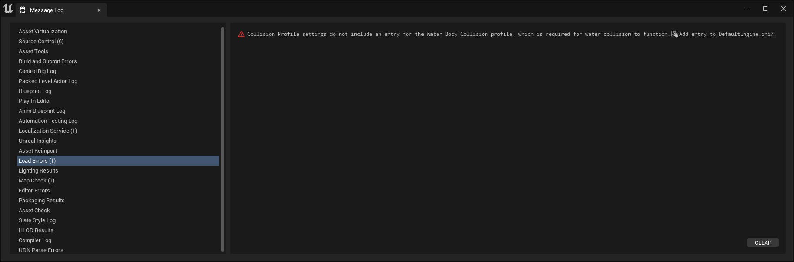

# Cesium for Unreal
1. 프로젝트를 생성하고 Rider에서 할 모든 작업이 종료되면 RiderLink, Cesium for Unreal, Pixel Streamin을 활성화한 후 재시작한다.
2. 뷰포트 왼쪽에 Cesium 탭이 생성되어있고 아래와 같은 에러 로그가 보이지만 정상이다.
   
3. 새 empty level을 생성한다. << CesiumMap >>
4. empty level은 아무것도 없는 검은 화면이므로 왼편의 Cesium 탭에서 Cesium SunSky를 추가해준다.
   
5. Connect to Cesium ion을 클릭해 Cesium ion에 접속한 후 Token 메뉴에서 API key를 생성한다.
6. 빈 화면에 Terrain을 추가하기 위해 ***QuickAdd Cesium ion Assets***에서 ***Cesium World Terrain + Bing Maps Aerial Imagery***를 추가한다.
   
7. 현재 뷰포트의 중심에 원하는 좌표를 보이게 하기 위해 Outliner 창에서 CesiumGeoreference를 선택해 Details 창에서 설정값을 아래와 같이 변경한다.
    1. Origin Latitude: 41.878101
    2. Origin Longitude: -87.59201
    3. Origin Height: 1000.0
8. 지구본을 돌린 것처럼 카메라는 가만히 있고 좌표만 카메라로 이동되어 아래와 같은 화면이 됨
    - Georeference 설정을 바꾸지 않고 카메라만 이동한 경우 지구(구체) 위를 평행하게 지나가게 됨
      
    - Georeference 설정을 변경해 뷰포트에 좌표가 보이도록 구체를 회전시킴
      
9. Cesium OSM Buildings를 선택해 빈 지도에 건물 추가
   
10. Cesium Quick Add Panel에서 Dynamic Pawn을 추가
    - Location: -179420, -120947, -81320
    - Rotation(Z, Yaw): 180
      
11. 시뮬레이션 결과
    > - WASD로 이동 가능
        
