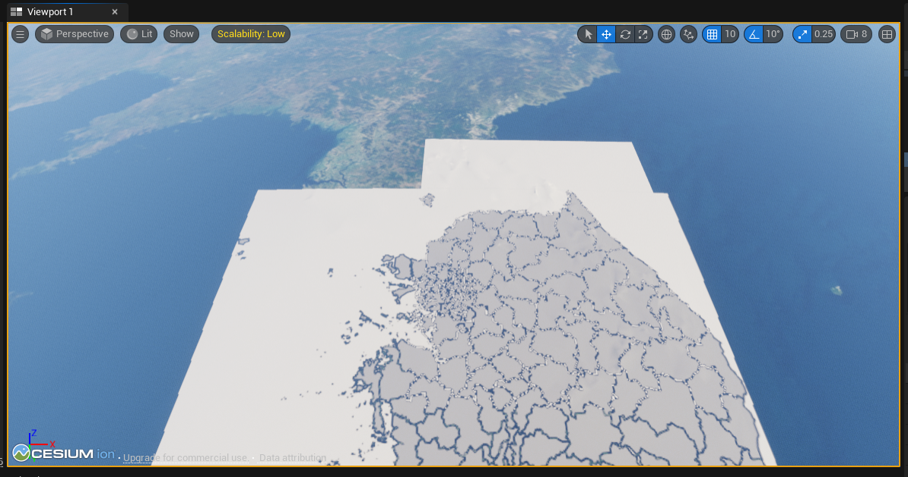
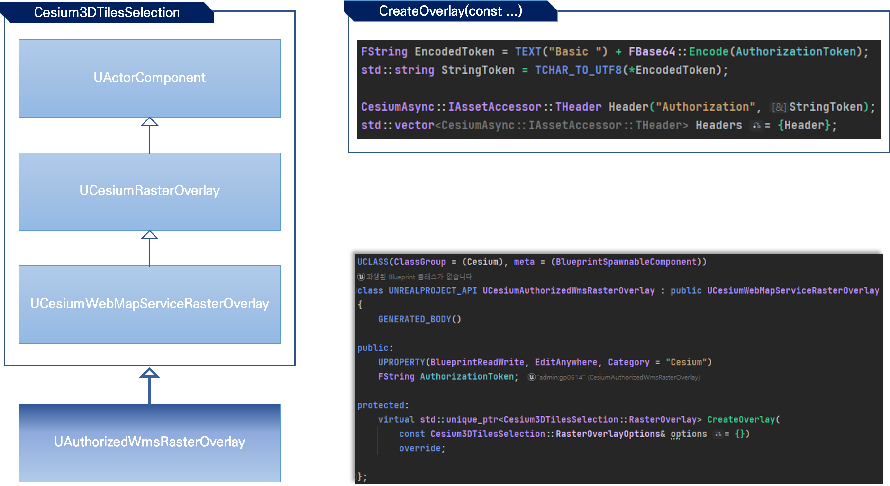
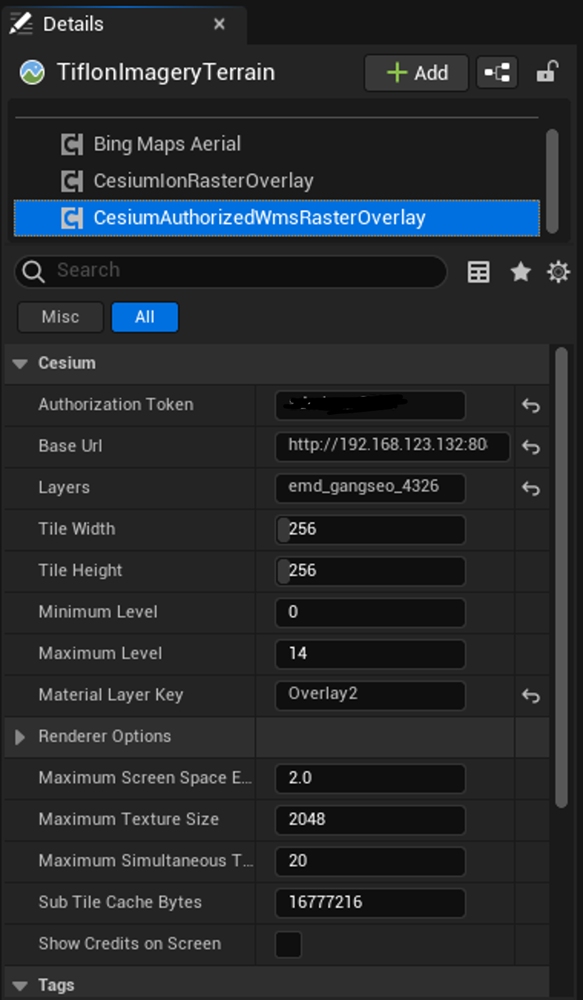
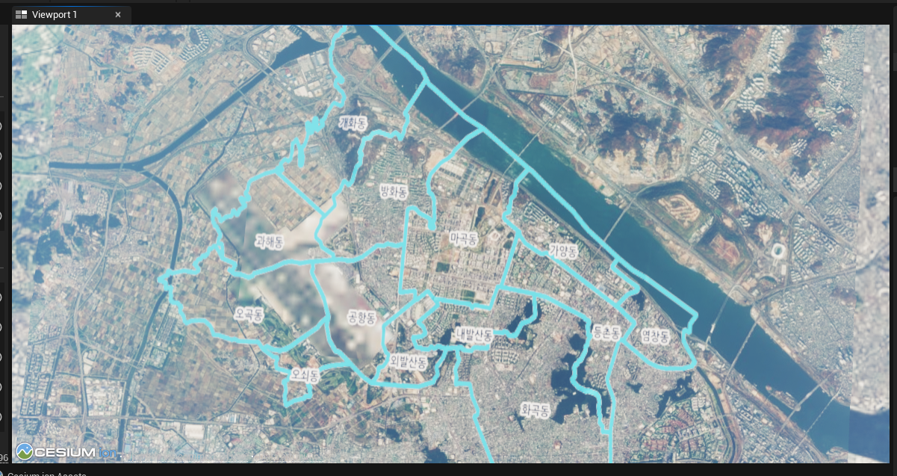

# Cesium for Unreal with Geoserver
> Cesium for Unreal 플러그인은 CesiumIonRasterOverlay(Actor Component)를 통해 Cesium ion Asset ID로 데이터를 가져올 수 있으며   
> CesiumWebMapServiceRasterOverlay 또는 CesiumTileMapServiceRasterOverlay Actor Component로 타 URL로부터 데이터를 표시할 수 있다.   
> - **Cesium ion Imagery(\*.tlf)** Load 결과
> 

# Geoserver Authorization
> Geoserver Request header에 Authorization 필드가 요구되어 살펴보니 header를 설정할 수 있는 컴포넌트를 
> 새로 만드는 게 낫다는 생각에 기존의 CesiumWebMapServiceRasterOverlay 컴포넌트를 상속받은 CesiumAuthorizedWmsRasterOverlay 컴포넌트를 추가함   
> 

## class UCesiumAuthorizedWmsRasterOverlay
> UCesiumWebMapServiceRasterOverlay class 상속 
> - Request header 부분만 수정하기 위해 CreateOverlay() 재정의
- Component Class Group: Cesium
  - 타 Cesium Component와 같은 그룹
- BlueprintSpawnableComponent
  - 블루프린트가 Component class spawn
- AuthorizationToken
  - Geoserver Request header ***"Authorization"*** 필드에 저장할 값 직접 입력

## virtual std::unique_ptr<Cesium3DTilesSelection::RasterOverlay> CreateOverlay(...) override
> Super::CreateOverlay() 리턴값에서 header 수정이 불가능(private)   
> UCesiumWebMapServiceRasterOverlay::CreateOverlay() body 전부 복붙   
> 단, return std::make_unique<>()의 3번째 parameter인 Header만 변경

- UPROPERTY AuthoriationToken Encoding
  - ```c++
    // Encoding 후 일반 문자열 Basic 연결
    FString EncodedToken = TEXT("Basic ") + FBase64::Encode(AuthorizationToken);
    
    // Unreal FString을 c++의 std::string으로 변환하는 매크로
    std::string StringToken = TCHAR_TO_UTF8(*EncodedToken);
    
    // Header에 추가
    // Header는 std::pair<std::string, std::string> 타입
    CesiumAsync::IAssetAccessor::THeader Header("Authorization", StringToken);
    
    // 전달인자 타입이 std::vector이므로 변환
    std::vector<CesiumAsync::IAssetAccessor::THeader> Headers = {Header};
    
    // return 구문의 3번째 Parameter로 Headers를 주면 완료
    ```

## Usage
- Cesium World Terrain에 CesiumAuthorizedWmsRasterOverlay Component 추가
- Authorization Token, BaseUrl, Layers 입력   

  - BaseUrl: ip:port/geoserver/storage/wms
  - Layers: 저장소를 제외한 layer 이름

### 결과



