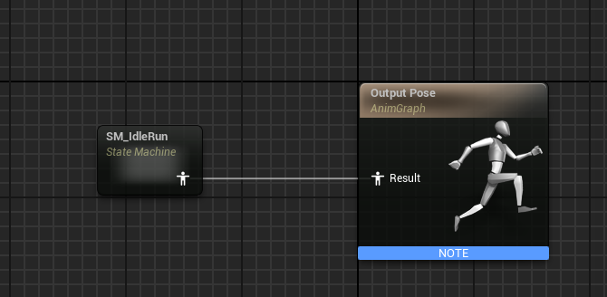
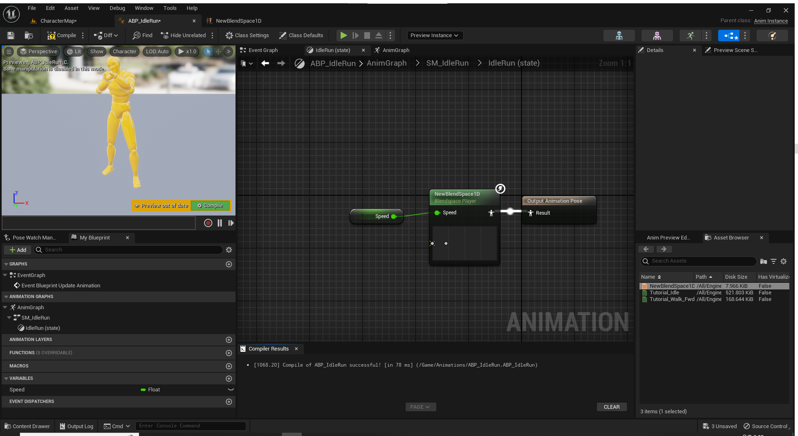
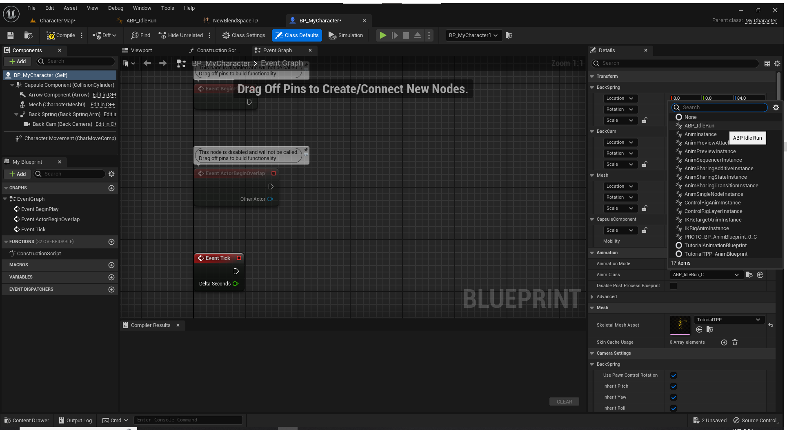

# Character

### Level
Basic type level 생성 후 이름은 CharacterMap으로 저장

## Character 개요
- Character class 생성
- Axis Mapping 설정 후 캐릭터 동작 구현
- 마우스 카메라 컨트롤 구현
- 점프 구현
- Build 후 Blueprint 계승 및 Character Mesh 추가
- Animation 추가
  - BlendSpace1D 사용
  - State Machine 사용

# Character class 생성
- New C++ Class... 선택   

- Character 선택 후 MyCharacter 이름의 클래스 생성
- 시뮬레이션 시작 시 캐릭터 로드 로그 출력
```c++
// BeginPlay() 함수 내부에 아래 코드 작성
check(GEngine != nullptr);
GEngine->AddOnScreenDebugMessage(-1, 5.0f, FColor::Orange, TEXT("MyCharacter beginPlay."));
```
- 캐릭터 뒤통수를 3인칭으로 볼 수 있도록 SpringArmComponent와 CameraComponent 추가
```c++
UPROPERTY(VisibleAnywhere)
USpringArmComponent BackSpring;

UPROPERTY(VisibleAnywhere)
UCameraComponent* BackCam;
```
- 캐릭터 생성자에서 SpringArmComponent와 CameraComponent를 장착   
  

# Axis Mapping 설정 후 캐릭터 동작 구현
- 캐릭터 동작 구현을 위한 Axis Mapping
- Project Settings에서 *Engine > Input* 선택    
  
- Bindings의 **Axis Mappings**에 MoveForward와 MoveRight를 추가한다.    
  
- 추가한 Axis Mapping을 캐릭터와 연결하기 위해 MyCharacter.cpp 파일의 SetupPlayerInputComponent()에 다음 코드를 추가한다.
  ```c++
  // PlayerInputComponent->BindAxis(<<Axis Mappings에서 추가한 이름>>, <<Axis Mapping을 바인딩할 클래스>>, <<사용자 입력이 실행할 UFUNCTION>>);
  PlayerInputComponent->BindAxis("MoveForward", this, &AMyCharacter::MoveForward);
  // w 또는 s를 누르면 AMyCharacter::MoveForward(float Value) 함수가 실행됨
  ```
- Axis Mapping MoveForward와 MoveRight 실행 시 동작할 UFUNCTION() 함수를 생성
    ```c++
    // AMyCharacter.h
    // 일반 C++ 함수에 블루프린트 비주얼 스크립팅 시스템 안에서 호출 또는 오버라이딩 가능하게 해주는 매크로
    UFUNCTION()
    void AMyCharacter::MoveForward(float Value);
    
    // AMyCharacter.cpp
    void AMyCharacter::MoveForward(float Value) {
        /* Controller Rotation 값을 저장 */
        FRotator ControllerRotation = GetControlRotation();
        
        /* 캐릭터를 중심(0, 0)으로 한 행렬 생성  */
        FRotationMatrix ControllerRotationMatrix = FRotationMatrix(ControllerRotation);
        
        /* 행렬에서 캐릭터가 바라보는 방향의 축을 벡터값으로 반환 */
        /* EAxis::X - 캐릭터가 바라보는 방향 */
        /* EAxis::Y - 캐릭터가 바라보는 방향의 오른쪽 */
        /* EAxis::Z - 캐릭터 위의 하늘 방향 */
        FVector ForwardVector = ControllerRotationMatrix.GetScaledAxis(EAxis::X);
        
        /* 캐릭터가 바라보는 방향 벡터로 Value 값만큼 이동 */
        Super::AddMovementInput(ForwardVector, Value);
    }
    ```

# 마우스 카메라 컨트롤 구현
- 동작 구현과 마찬가지로 Axis Mapping 설정과 UFUNCTION()을 구현 후 바인딩한다.   
  
> Lookup 값을 -1로 설정해야 마우스를 위로 올릴때 화면이 위를 보여준다.   

- 바인딩 후 결과 화면   

- 3인칭 캐릭터 회전 설정
  ```c++
  /* 카메라 회전 시 캐릭터 회전 방지 (default true) */
  bUseControllerRotationYaw = false;
  
  /* 캐릭터가 이동하는 방향이 항상 캐릭터의 정면이 되도록 설정 (default true) */
  GetCharacterMovement()->bOrientRotationToMovement = true;
  
  /* 캐릭터가 이동 시에 SpringArm Component가 바라보는 방향으로 캐릭터 회전 (default true) */
  BackSpring->bUsePawnControlRotation = true;
  ```

# 점프 구현
- Axis Mapping이 아닌 **Action Mapping**에서 StartJump와 StopJump를 추가한다.
- ACharacter 클래스는 boolean 변수 bPressedJump가 있는데 이 변수가 점프를 구현한다.
- UFUNCTION() StartJump()에서는 true, UFUNCTION() StopJump()에서는 false로 변경한다.
- SetupPlayerInputComponent에서 BindAction() 함수를 통해 Action을 바인딩한다.   
  
  > BindAction(<<Action Mappings에서 추가한 이름>>, <<열거형 EInputEvent 타입의 이벤트값>>, <<Action을 바인딩할 클래스>>, <<사용자 입력이 실행할 UFUNCTION>>);

# Build 후 Blueprint 계승 및 Character Mesh 추가
1. Unreal Editor에서 빌드하기 (라이브 코딩)
   - 라이브 코딩 설정하기   
     
   - 라이브 코딩 단축키
     **Ctrl + Alt + F11**
   - 재컴파일하기   
    
2. Rider에서 빌드하기
    > Unreal Editor가 실행중이 아닐 때만 사용 가능   
   
3. 빌드 결과를 블루프린트로 계승 후 BP_MyCharacter로 이름 변경   
   
4. 자동으로 블루프린트 에디터가 열리지 않는다면 컨텐츠 브라우저에서 더블클릭하여 에디터 창을 연다.
5. 우측의 Details 패널에서 Mesh탭의 Skeletal Mesh Asset을 Unreal에서 기본으로 제공해주는 TutorialTPP를 선택하면 뷰포트에 캐릭터 Mesh가 보이는데 Details에서 Location Z값을 -100, Rotation Z값을 -90으로 변경한다.
6. 좌측의 Components 탭에서 CapsuleComponent를 선택하고 Details에서 Capsule Half Height 값을 97로 설정하면 아래와 같은 화면이 된다.   
   

# Animation 추가
Unreal은 TutorialTPP Mesh뿐만 아니라 이를 이용하는 애니메이션도 지원해준다.
> Unreal Editor의 GuidedTutorials 플러그인에서 제공하는 **NewBlendSpace1D**, **Tutorial_Idle**, **Tutorial_Walk_Fwd** 3개의 UASSET 파일을 사용한다.   
> Animation Asset은 동작 하나만 정의하고 BlendSpace는 변수 값에 따라 애니메이션들을 어떻게 적용할 건지 정의한다.   

> NewBlendSpace1D는 **Speed**라는 변수 값이 0일 땐 ***Tutorial_Idle*** 애니메이션을 적용하고 
> 125 이상일 땐 ***Tutorial_Walk_Fwd*** 애니메이션을 적용한다. 
> Speed 값이 0과 125 사이일 땐 자동으로 두 애니메이션에 보간법을 적용한 듯한 애니메이션을 적용하게 된다.

## Animation Blueprint
> 애니메이션을 적용하는 방법은 Animation Blueprint와 Animation Asset, Custom Mode를 사용하는 3가지 방법이 있는데 Animation Bluprint를 적용하는 방법은 다음과 같다.

1. 마우스 우클릭 후 Animation Blueprint 만들기
- AnimInstance의 서브클래스이며 EventGraph와 AnimGraph를 기본으로 제공   

2. Event Graph를 열고 아래와 같이 만들기   

   > 빈 공간에 우클릭하여 노드를 생성할 수 있다.
   > 1. 이벤트가 진행되는 동안 CharacterMovementComponent를 읽기 위해 캐스팅
   > 2. 캐릭터로 캐스팅 된 폰으로부터 CharacterMovementComponent 읽기
   > 3. GetVelocity 노드로 Velocity 벡터 멤버 읽기
   > 4. VectorLengthXY 노드로 Velocity 벡터의 X, Y값만 사용하여 벡터의 크기 구하고 Speed 변수에 저장하기
3. AnimGraph를 열고 우측 하단의 AssetBrowser에서 BlendSpace를 드래그하고 Output Pose에 연결할 수도 있지만 
동작이 추가될 때마다 새로운 Animation Bluprint를 만들어야 하기 때문에 그렇게 하지 않고 StateMachine을 사용한다.
4. 빈 공간 우클릭으로 새 State Machine SM_IdleRun을 추가한 후 Output Pose에 연결한다.   

5. SM_IdleRun을 더블클릭하여 열면 우클릭으로 새 State를 추가할 수 있다. 
대기상태부터 달리기까지 연결된 NewBlendSpace1D를 사용할 State, IdleRun을 추가한다.
6. IdleRun State와 Entry를 연결한다. 새로운 동작이 추가될 때마다 새로운 BlendSpace를 사용하는 새로운 State를 만들고 연결한 뒤 Transition Rule만 적용하면 된다.
7. State마다 Animation 또는 BlendSpace를 추가할 수 있다. NewBlendSpace1D를 추가한다.
8. 전달인자로 Speed 값이 필요한데 Event Graph에서 사용한 변수를 그대로 가져와 연결하고 컴파일하면 다음과 같다.   

9. 이제 아래와 같이 BP_MyCharacter 블루프린트 에디터를 열고 Animation 탭의 Anim Class를 ABP_IdleRun을 선택한다.   

10. 컴파일 후 시뮬레이션 해보면 대기 시와 이동 시 애니메이션이 적용된 모습을 볼 수 있다.   

