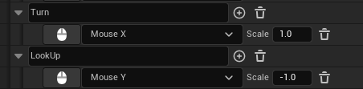

# Character

### Level
Basic type level 생성 후 이름은 CharacterMap으로 저장

## Character 개요
- Character class 생성
- Axis Mapping 설정 후 캐릭터 동작 구현
- 마우스 카메라 컨트롤 구현
- 점프 구현
- Build 후 Blueprint 계승
- Character Mesh 추가
- Animation 추가
  - BlendSpace1D
  - State Machine
- Animation Blueprint 계승

# Character class 생성
- New C++ Class... 선택

- Character 선택 후 MyCharacter 이름의 클래스 생성
- 시뮬레이션 시작 시 캐릭터 로드 로그 출력
```c++
// BeginPlay() 함수 내부에 아래 코드 작성
check(GEngine != nullptr);
GEngine->AddOnScreenDebugMessage(-1, 5.0f, FColor::Orange, TEXT("MyCharacter beginPlay."));
```

# Axis Mapping 설정 후 캐릭터 동작 구현
- 캐릭터 동작 구현을 위한 Axis Mapping
- Project Settings에서 *Engine > Input* 선택
  
- Bindings의 **Axis Mappings**에 MoveForward와 MoveRight를 추가한다.
  
- 추가한 Axis Mapping을 캐릭터와 연결하기 위해 MyCharacter.cpp 파일의 SetupPlayerInputComponent()에 다음 코드를 추가한다.
  ```c++
  // PlayerInputComponent->BindAxis(<<Axis Mappings에서 추가한 이름>>, <<Axis Mapping을 바인딩할 클래스>>, <<사용자 입력이 실행할 UFUNCTION>>);
  PlayerInputComponent->BindAxis("MoveForward", this, &AMyCharacter::MoveForward);
  // w 또는 s를 누르면 AMyCharacter::MoveForward(float Value) 함수가 실행됨
  ```
- Axis Mapping MoveForward와 MoveRight 실행 시 동작할 UFUNCTION() 함수를 생성
  ```c++
  // AMyCharacter.h
  // 일반 C++ 함수에 블루프린트 비주얼 스크립팅 시스템 안에서 호출 또는 오버라이딩 가능하게 해주는 매크로
  UFUNCTION()
  void AMyCharacter::MoveForward(float Value);
  
  // AMyCharacter.cpp
  void AMyCharacter::MoveForward(float Value) {
    // Actor(Character)가 바라보는 방향 벡터에 Value 값을 더해서 이동
    // GetActorLeftVector()나 GetActorLeftVector()는 존재하지 않아서 MoveForward와 MoveRight Axis Mapping에 음수 값으로 반대 방향 지정
    FVector ForwardVector = GetActorForwardVector();
    AddMovementInput(ForwardVector, Value);
  }
  ```

# 마우스 카메라 컨트롤 구현
- 동작 구현과 마찬가지로 Axis Mapping 설정과 UFUNCTION()을 구현 후 바인딩한다.
  
  
  

# 점프 구현
- Axis Mapping이 아닌 **Action Mapping**에서 StartJump와 StopJump를 추가한다.
- ACharacter 클래스는 boolean 변수 bPressedJump가 있는데 이 변수가 점프를 구현한다.
- UFUNCTION() StartJump()에서는 true, UFUNCTION() StopJump()에서는 false로 변경한다.
- SetupPlayerInputComponent에서 BindAction() 함수를 통해 Action을 바인딩한다.
  
  > BindAction(<<Action Mappings에서 추가한 이름>>, <<열거형 EInputEvent 타입의 이벤트값>>, <<Action을 바인딩할 클래스>>, <<사용자 입력이 실행할 UFUNCTION>>);

# Build 후 Blueprint 계승
1. Unreal Editor에서 빌드하기
   
2. Rider에서 빌드하기
   

# Character Mesh 추가

# Animation 추가

## BlendSpace1D

## StateMachine


# Animation Bluprint 계승


