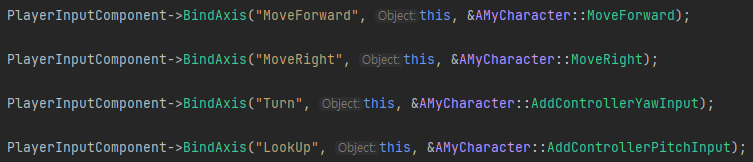
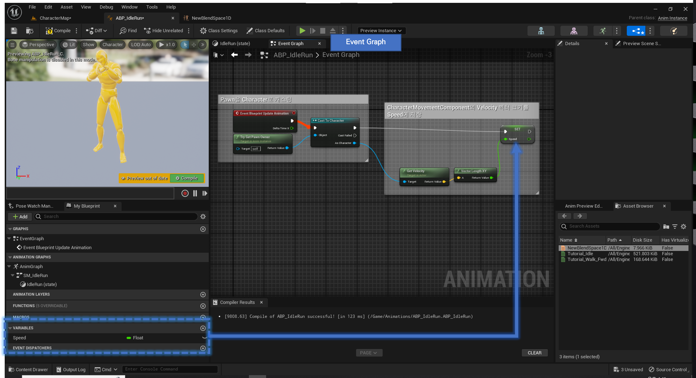

# Character

### Level
Basic type level 생성 후 이름은 CharacterMap으로 저장

## Character 개요
- Character class 생성
- Axis Mapping 설정 후 캐릭터 동작 구현
- 마우스 카메라 컨트롤 구현
- 점프 구현
- Build 후 Blueprint 계승 및 Character Mesh 추가
- Animation 추가
  - BlendSpace1D 사용
  - State Machine 사용

# Character class 생성
- New C++ Class... 선택   

- Character 선택 후 MyCharacter 이름의 클래스 생성
- 시뮬레이션 시작 시 캐릭터 로드 로그 출력
```c++
// BeginPlay() 함수 내부에 아래 코드 작성
check(GEngine != nullptr);
GEngine->AddOnScreenDebugMessage(-1, 5.0f, FColor::Orange, TEXT("MyCharacter beginPlay."));
```
- 캐릭터 뒤통수를 3인칭으로 볼 수 있도록 SpringArmComponent와 CameraComponent 추가
```c++
UPROPERTY(VisibleAnywhere)
USpringArmComponent BackSpring;

UPROPERTY(VisibleAnywhere)
UCameraComponent* BackCam;
```
- 캐릭터 생성자에서 SpringArmComponent와 CameraComponent를 장착   
  

# Axis Mapping 설정 후 캐릭터 동작 구현
- 캐릭터 동작 구현을 위한 Axis Mapping
- Project Settings에서 *Engine > Input* 선택    
  
- Bindings의 **Axis Mappings**에 MoveForward와 MoveRight를 추가한다.    
  
- 추가한 Axis Mapping을 캐릭터와 연결하기 위해 MyCharacter.cpp 파일의 SetupPlayerInputComponent()에 다음 코드를 추가한다.
  ```c++
  // PlayerInputComponent->BindAxis(<<Axis Mappings에서 추가한 이름>>, <<Axis Mapping을 바인딩할 클래스>>, <<사용자 입력이 실행할 UFUNCTION>>);
  PlayerInputComponent->BindAxis("MoveForward", this, &AMyCharacter::MoveForward);
  // w 또는 s를 누르면 AMyCharacter::MoveForward(float Value) 함수가 실행됨
  ```
- Axis Mapping MoveForward와 MoveRight 실행 시 동작할 UFUNCTION() 함수를 생성
    ```c++
    // AMyCharacter.h
    // 일반 C++ 함수에 블루프린트 비주얼 스크립팅 시스템 안에서 호출 또는 오버라이딩 가능하게 해주는 매크로
    UFUNCTION()
    void AMyCharacter::MoveForward(float Value);
    
    // AMyCharacter.cpp
    void AMyCharacter::MoveForward(float Value) {
        /* Controller Rotation 값을 저장 */
        FRotator ControllerRotation = GetControlRotation();
        
        /* 캐릭터를 중심(0, 0)으로 한 행렬 생성  */
        FRotationMatrix ControllerRotationMatrix = FRotationMatrix(ControllerRotation);
        
        /* 행렬에서 캐릭터가 바라보는 방향의 축을 벡터값으로 반환 */
        /* EAxis::X - 캐릭터가 바라보는 방향 */
        /* EAxis::Y - 캐릭터가 바라보는 방향의 오른쪽 */
        /* EAxis::Z - 캐릭터 위의 하늘 방향 */
        FVector ForwardVector = ControllerRotationMatrix.GetScaledAxis(EAxis::X);
        
        /* 캐릭터가 바라보는 방향 벡터로 Value 값만큼 이동 */
        Super::AddMovementInput(ForwardVector, Value);
    }
    ```

# 마우스 카메라 컨트롤 구현
- 동작 구현과 마찬가지로 Axis Mapping 설정과 UFUNCTION()을 구현 후 바인딩한다.   
  
> Lookup 값을 -1로 설정해야 마우스를 위로 올릴때 화면이 위를 보여준다.   

- 바인딩 후 결과 화면   

- 3인칭 캐릭터 회전 설정
  ```c++
  /* 카메라 회전 시 캐릭터 회전 방지 (default true) */
  bUseControllerRotationYaw = false;
  
  /* 캐릭터가 이동하는 방향이 항상 캐릭터의 정면이 되도록 설정 (default true) */
  GetCharacterMovement()->bOrientRotationToMovement = true;
  
  /* 캐릭터가 이동 시에 SpringArm Component가 바라보는 방향으로 캐릭터 회전 (default true) */
  BackSpring->bUsePawnControlRotation = true;
  ```

# 점프 구현
- Axis Mapping이 아닌 **Action Mapping**에서 StartJump와 StopJump를 추가한다.
- ACharacter 클래스는 boolean 변수 bPressedJump가 있는데 이 변수가 점프를 구현한다.
- UFUNCTION() StartJump()에서는 true, UFUNCTION() StopJump()에서는 false로 변경한다.
- SetupPlayerInputComponent에서 BindAction() 함수를 통해 Action을 바인딩한다.   
  
  > BindAction(<<Action Mappings에서 추가한 이름>>, <<열거형 EInputEvent 타입의 이벤트값>>, <<Action을 바인딩할 클래스>>, <<사용자 입력이 실행할 UFUNCTION>>);

# Build 후 Blueprint 계승 및 Character Mesh 추가
1. Unreal Editor에서 빌드하기 (라이브 코딩)
   - 라이브 코딩 설정하기   
     
   - 라이브 코딩 단축키
     **Ctrl + Alt + F11**
   - 재컴파일하기   
    
2. Rider에서 빌드하기
    > Unreal Editor가 실행중이 아닐 때만 사용 가능   
   
3. 빌드 결과를 블루프린트로 계승 후 BP_MyCharacter로 이름 변경   
   
4. 자동으로 블루프린트 에디터가 열리지 않는다면 컨텐츠 브라우저에서 더블클릭하여 에디터 창을 연다.
5. 우측의 Details 패널에서 Mesh탭의 Skeletal Mesh Asset을 Unreal에서 기본으로 제공해주는 TutorialTPP를 선택하면 뷰포트에 캐릭터 Mesh가 보이는데 Details에서 Location Z값을 -100, Rotation Z값을 -90으로 변경한다.
6. 좌측의 Components 탭에서 CapsuleComponent를 선택하고 Details에서 Capsule Half Height 값을 97로 설정하면 아래와 같은 화면이 된다.   
   

# Animation 추가
Unreal은 TutorialTPP Mesh뿐만 아니라 이를 이용하는 애니메이션도 지원해준다.
> Editor의 GuidedTutorials 플러그인에서 제공하는 **NewBlendSpace1D**, **Tutorial_Idle**, **Tutorial_Walk_Fwd** 3개의 UASSET 파일을 사용한다.   
> 2개의 Animation Blueprint 클래스를 사용
1. Animation Blueprint 추가   

2. NewBlendSpace1D를 사용하는 ABP_BlendSpace1D와 StateMachine을 사용하는 ABP_StateMachine 2개 생성

## ABP_BlendSpace1D
1. ABP_BlendSpace1D 에디터를 열고 우측 하단의 AssetBrowser에서 NewBlendSpace1D를 더블클릭해 에디터 창을 연다.   

2. ABP_BlendSpace1D로 돌아가 AnimGraph를 열고 AssetBrowser에서 NewBlendSpace1D를 드래그해 OutputPose와 연결한다.   

3. NewBlendSpace1D 노드의 Speed parameter를 변수로 승격시킨다.   

4. EventGraph를 열고 아래와 같이 설정, 빈 공간에 우클릭하여 노드를 검색하고 추가할 수 있다.   

5. BP_MyCharacter의 AnimClass를 ABP_BlendSpace1D로 선택한 뒤 시뮬레이션을 진행하면 애니메이션이 적용됨.

## ABP_StateMachine
1. ABP_StateMachine 에디터를 열고 우측 하단의 AssetBrowser에서 Tutorial_Walk_Fwd와 Tutorial_Idle을 볼 수 있음
2. AnimGraph에 StateMachine을 추가한다.   

3. 생성한 StateMachine 노드를 더블클릭하거나 좌측하단의 Graphs 창에서 선택하여 StateMachine을 연다.
4. 빈 공간에 우클릭 후 Add State를 선택하거나 우측 하단의 Asset Browser에서 애니메이션 에셋을 드래그하면 새 State가 추가된다.   

5. State를 더블클릭으로 열고 Asset Browser에서 애니메이션 애셋을 드래그 후 연결하면 아래와 같다.    

> State를 만들 때 애셋을 드래그해서 만든 경우 자동으로 애셋이 등록되어있다.
6. 시작 State의 테두리부터 다음 State의 테두리까지 드래그해 Transition rule을 추가한다.   

7. Transition rule에서 사용할 Speed 변수(float)를 추가하고 Transition rule을 열고 다음과 같이 만든다.   

8. 모든 State와 Transition rule을 설정한 후 ABP_BlendSpace1D와 똑같은 EventGraph를 만들고 컴파일 한다.
9. 마찬가지로 BP_MyCharacter의 AnimClass에서 ABP_StateMachine을 선택하면 애니메이션이 적용된다.


