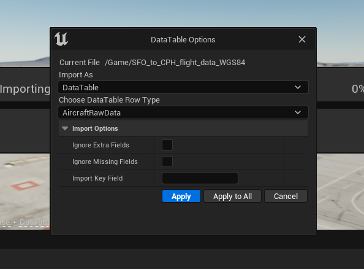
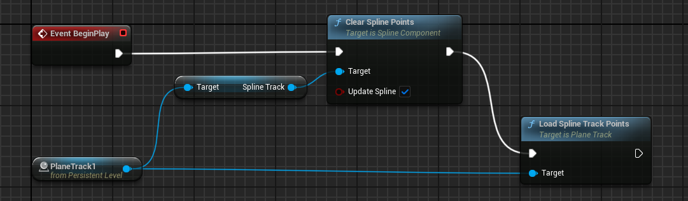
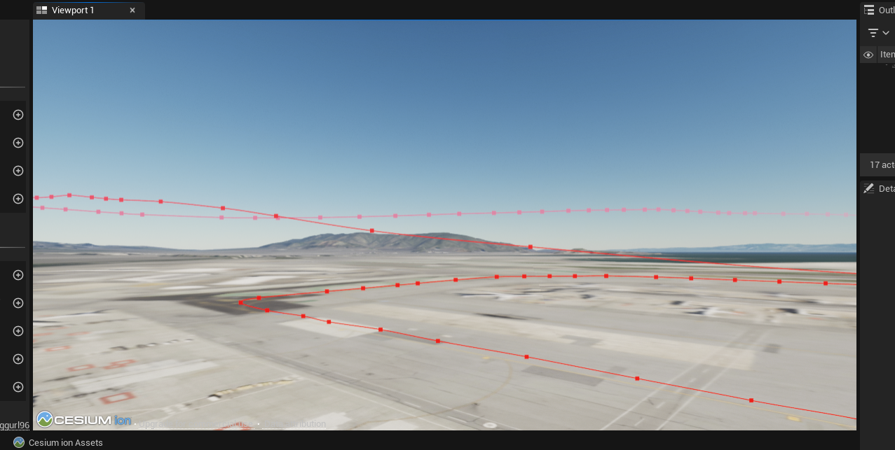
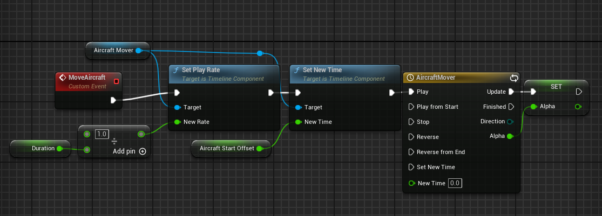
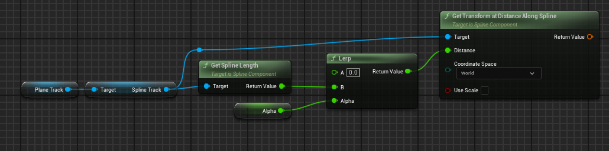
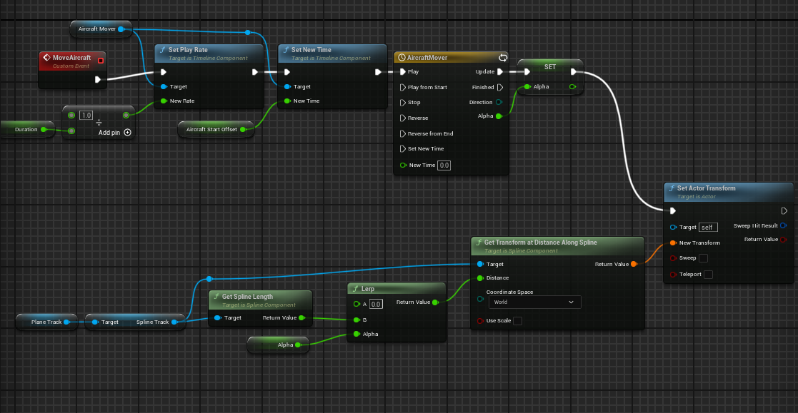
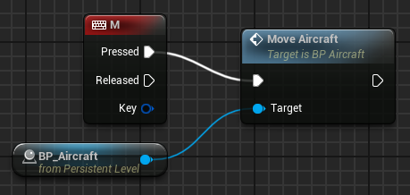
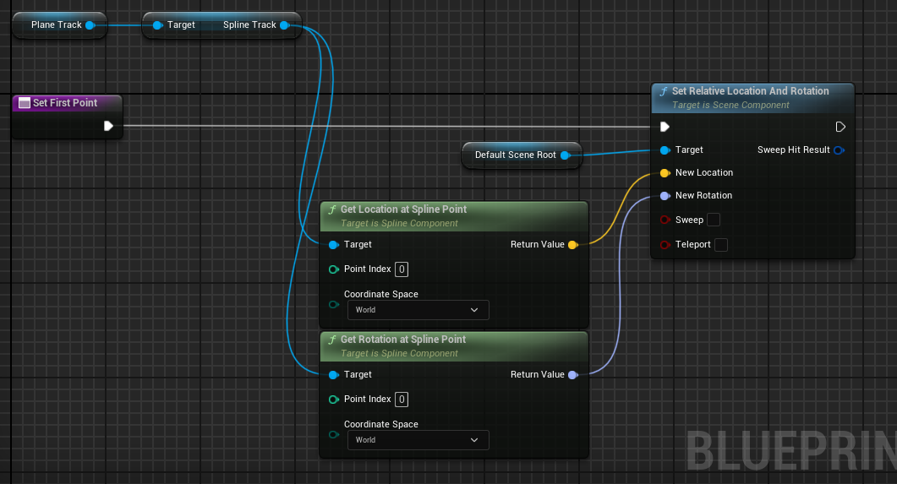
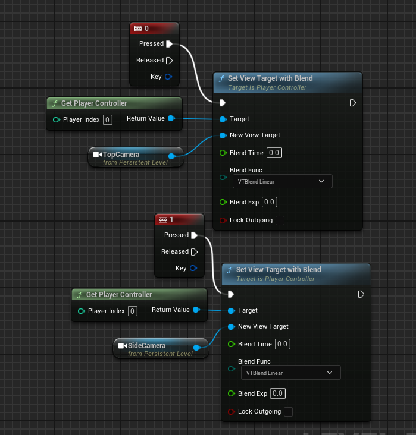

# [Cesium for Unreal example - Build a Flight Tracker with Cesium for Unreal](https://cesium.com/learn/unreal/unreal-flight-tracker/)
> This tutorial will walk through the process of visualizing a flight from San Francisco to Copenhagen using real-world flight data.
> - Import real-world flight data into Unreal Engine
> - Create a flight path using the data and USplineComponent
> - Import a model of an airplane and have the plane follow the flight path
> - Switch between different camera views in-flight

# Create an Unreal level
1. FlightTrackMap 생성 후 CesiumSunSky, Cesium terrain 생성
   - Origin Latitude: 37.61779
   - Origin Longitude: -122.390533
   - Origin Height: 0.0

# Add the PlaneTrack class
1. Actor class PlaneTrack 생성
2. Source 폴더 아래의 *\*.Build.cs* 파일에 아래 코드 추가
```c++
PrivateDependencyModuleNames.AddRange(new String[]{"CesiumRuntime"});

CppStandard = CppStandardVersion.Cpp17;
```
3. PlaneTrack class에 비행 정보, 경로, 적절한 좌표 변환 시스템을 저장할 변수를 추가
```c++
UPROPERTY(BlueprintReadOnly, Category = "FlightTracker")
USplineComponent* SplineTrack;

UPROPERTY(EditAnywhere, Category = "FlightTracker")
ACesiumGeoreference* CesiumGeoreference;

UPROPERTY(EditAnywhere, Category = "FlightTracker")
UDataTable* AircraftRawDataTable;
```
4. 추가한 멤버중 CesiumGeoreference와 AircraftRawDataTable은 Unreal Editor에서 설정하고 SplineTrack만 생성자에서 설정
```c++
SplineTrack = CreateDefaultSubobject<USplineComponent>(TEXT("SplineTrack"));

SpilneTrack->SetDrawDebug(true);

SplineTrack->SetUnselectedSplineSegmentColor(FLinearColor(1.0f, 0.0f, 0.0f));
```

# Bring in real-world flight data
> [github_resources] 폴더에 ***SFO_to_CPH_flight_data_WGS84.csv***   
> 프로젝트에 csv 파일을 저장하기 위해 Unreal Engine의 DataTable을 사용한다.   
1. PlaneTrack.h에 flight database strcture를 추가한다.
```c++
USTRUCT(BlueprintType)
struct FAircraftRawData : public FTableRowBase
{
	GENERATED_USTRUCT_BODY()

public:
	FAircraftRawData()
		: Longitude(0.0)
		, Latitude(0.0)
		, Height(0.0)
	{}

	UPROPERTY(EditAnywhere, Category = "FlightTracker")
	double Longitude;

	UPROPERTY(EditAnywhere, Category = "FlightTracker")
	double Latitude;

	UPROPERTY(EditAnywhere, Category = "FlightTracker")
	double Height;
};
````
2. 컴파일 후 Content Browser에서 csv 파일을 아래와 같이 import 한다.   

3. FAircraftRawData struct의 언리얼 프로젝트 내의 이름인 AircraftRawData 블루프린트 타입의 DataTable이 생성된다.

# Add positions to the flight track
1. 아래 코드를 PlaneTrack.h에 추가
```c++
#include <gim/vec3>
#include "CesiumGeospatial/Ellipsoid.h"
#include "CesiumGeospatial/Cartographic.h"
```
```c++
public:
    UFUNCTION(BlueprintCallable, Category = "FlightTracker")
    void LoadSplineTrackPoints();
```
2. 각각의 좌표를 unreal 좌표로 변환 후 SplineComponent에 저장
- csv 파일의 줄마다 읽어 좌표를 분할
```c++
// 좌표 분할
FAircraftRawData* Point = reinterpret_cast<FAircraftRawData*>(row.Value);
double PointLatitude = Point->Latitude;
double PointLongitude = Point->Longitude;
double PointHeight = Point->Height;
```
- 좌표를 unreal 좌표의 FVector로 변경 후 SplineComponent에 Point 추가
```c++
// UE 내의 위치 계산 후 SplineComponnet에 Point 추가
glm::dvec3 UECoords = this->CesiumGeoReference->TransformLongitudeLatitudeHeightToUnreal(glm::dvec3(PointLongitude, PointLatitude, PointHeight));
FVector SplinePointPosition = FVector(UECoords.x, UECoords.y, UECoords.z);
this->SplineTrack->AddSplinePointAtIndex(SplinePointPosition, PointIndex, ESplineCoordinateSpace::World, false);
```
- 좌표를 WGS84 좌표계의 벡터로 변경 후 지구중심고정좌표계로 변환
```c++
// 좌표계 설정 WGS84
const CesiumGeospatial::Ellipsoid& Ellipsoid = CesiumGeospatial::Ellipsoid::WGS84;

// 좌표계의 위도, 경도를 벡터로 표현
glm::dvec3 upVector = Ellipsoid.geodeticSurfaceNormal(CesiumGeospatial::Cartographic(FMath::DegreesToRadians(PointLongitude),
    FMath::DegreesToRadians(PointLatitude), FMath::DegreesToRadians(PointHeight)));

// ECEF - Earth-Centered Earth-Fixed, 지구중심고정좌표계: 지구의 중력 중심을 원점으로 하는 좌표계
glm::dvec4 ecefUp(upVector, 0.0);
```
- 지구중심고정좌표계를 unreal 좌표로 변환 후 FVector로 만들어 추가된 SplineComponent의 Point의 벡터로 설정
```c++
// ecef, georeference, unreal 좌표계 변환을 캡슐화한 객체
const GeoTransforms& GeoTransforms = this->CesiumGeoReference->GetGeoTransforms();

// ecef -> unreal 좌표계 변환 행렬을 통해 unreal 좌표를 4차원 벡터로 저장
const glm::dmat4& ecefToUnreal = GeoTransforms.GetEllipsoidCenteredToAbsoluteUnrealWorldTransform();
glm::dvec4 unrealUp = ecefToUnreal * ecefUp;
this->SplineTrack->SetUpVectorAtSplinePoint(PointIndex++, FVector(unrealUp.x, unrealUp.y, unrealUp.z), ESplineCoordinateSpace::World, false);
```
> 위 코드들을 LoadSplineTrackPoints()에 삽입
> ```c++
> void APlaneTrack::LoadSplinetrackPoints()
> {
>   if(this->AricraftsRawDataTable != nullptr && this->CesiumGeoReference != nullptr)
>   {
>       int32 PointIndex = 0;
>       for (auto& row : this->AricraftsRawDataTable->GetRowMap())
>       {
>           ;// 여기에 삽입
>       }
>   }
> }
> ```
3. 컴파일 후 뷰포트에 PlaneTrack 추가
4. PlaneTrack actor의 details panel에서 Flighttracker 카테고리의 CesiumGeoreference와 Aricrafts Raw Data Table을 설정한다.
5. 레벨 블루프린트 에디터를 열고 event graph에서 Event BeginPlay 노드에 ClearSplinePoints와 LoadSplineTrackPoints 노드를 차례대로 연결한다.   

> PlaneTrack1 노드는 우클릭 후 *Create a Reference to PlaneTrack1*을 선택해 생성할 수 있음
6. 컴파일 후 실행 시 하단의 cmd에 명령어 ***ShowFlag.Splines 1***을 입력하면 레벨의 뷰포트가 아래 화면처럼 변한다.   


# Add the aircraft
1. [Plane 3D Model download](https://skfb.ly/ooCMo) 후 Import to Games
2. **BP_Aircraft**: Blueprint class Actor 생성
3. **AircraftMesh**: StaticMesh Component 추가 후 Mesh 설정 (Rotation Yaw: -90)
4. **MoveAircraft**: **Event Graph** custom event 생성
5. **Aircraft Mover**: Add Timeline
6. 타임라인에서 Add Float Track 이름 = alpha, length = 1
7. (0, 0)과 (1, 1)에 키 생성
8. **Use Last Keyframe**, **Loop** check box 체크해 반복하도록 설정
9. 이벤트 그래프로 돌아가 타임라인 노드의 alpha 핀에 우클릭하여 변수로 승격
10. My Bluepring 탭의 Add New 버튼으로 float 타입의 Duration 변수 생성
11. AircraftStartOffset float 타입의 변수, Slider Range와 Value Range 값은 0과 1사이
12. PlaneTrack 오브젝트 레퍼런스 추가
13. 아래와 같이 타임라인 이벤트 그래프 완성   

14. PlaneTrack Spline update 이벤트 추가   

15. actor transform 추가 후 컴파일   

16. level에 BP_Aircraft 추가 후 다시 level event graph로 돌아와서 아래 노드 생성 후 컴파일   

17. FlightTrackMap editor 에서 BP_Aircraft 액터 선택 후 details 패널에서 Duration 100000, AircraftStartOffset 0, Plane Track 설정 후 M 클릭 시 비행기가 이동하게 됨
18. 시뮬레이션 시작 시 LoadSplineTrackPoints() 실행 후 BP_Aircraft 위치를 SplineComponent의 시작 위치에 벡터 방향을 바라보도록 설정
19. BP_Aircraft blueprint editor My Blueprint tab Functions에서 SetFirstPoint 추가   

20. LoadSplineTrackPoints() 실행 후 동작하도록 FlightTrackMap의 EventGraph에서 LoadSplineTrackPoints 노드 다음에 SetFirstPoint 연결

# Switch between different camera views
1. BP_Aircraft 액터에 SideCamera, TopCamera actor 추가
2. 0과 1로 변경 가능하도록 레벨 블루프린트 에디터에 이벤트 추가
