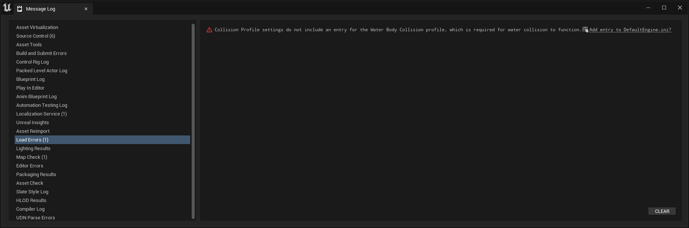

# UnrealProject
### 목차
- 
- 
- 
- 
- 
- 
- 
- 
- 
- 
- 
- 
- 
- 
- 
- 
- 
## 일반적인 Unreal Project의 진행 순서
1. AActor 클래스를 상속받는 C++ 클래스를 작성 후 빌드
   [사진 넣을거임]()
2. 빌드한 소스코드로부터 블루프린트 생성 후 컴파일
   [사진 넣을거임]()
3. 컴파일 된 블루프린트를 뷰포트에 배치하여 맵 완성
   [사진 넣을거임]()
4. 기본 맵 설정 및 맵을 연결해 월드 생성 후 배포
   [사진 넣을거임](exe파일 하나 보여주면 되겠지)

# Editor Tools
- Unreal Editor 5.1.1
- Rider

## Unreal Editor 화면

- ViewPort
  - 현재 작업중인 맵이 보여지는 화면
  - 액터를 배치하고 이동, 회전, 스케일링 하는 등의 작업이 가능함
- Docked Layout
  - Content Browser(Drawer), OutputLog 등의 창을 고정 가능한 레이아웃
- Outliner
  - 뷰포트에 배치된 액터들을 확인할 수 있음
  - 폴더를 생성해 묶어서 관리할 수 있음
- Details
  - 뷰포트의 액터를 선택해 위치, 회전 등의 작업과 컴포넌트 추가 등을 지원해주는 창

## Editor Tool 비교
### Visual Studio
#### Vsual Studio Workloads
- .NET desktop development
- Desktop development with C++
- Universal Windows Platform development
- Game development with C++
  - C++ profiling tools
  - C++ AddressSanitizer
  - Windows 10 SDK
  - IntelliCode
> Unreal 문법 작성 시 들여쓰기 문제로 플러그인을 추가로 설치해줘야 하고 프로그램 자체가 무거움 

### Visual Studio Code
#### Extensions
- C/C++ Extensions Pack
- C# Extensions
> 필요한 익스텐션이 얼마 없는게 당연한 게 UE IntelliSense Extension이 5점대는 지원해주지 않음

### Rider
#### Plugins
- RiderLink(Unreal Plugin)와 UnrealLink(Rider Plugin)
> 유료이고 프로젝트 생성 후 처음 열면 인덱스 구성 등으로 몇 분정도 소요됨
#### 주의사항
- Microsoft Defender 제외 목록 추가 - 자동 선택
  
- RiderLink 플러그인 ***게임에 설치***
  - 엔진에 설치 선택 시 UE5는 오류 발생

# Plugins
- RiderLink
  - Unreal Editor에서 사용 가능한 Unreal과 Rider의 통합 개발 환경 지원 Plugin
- Cesium for Unreal
  - 3D Geospatial Plugin
- Pixel Streaming
  - Web Streaming Plugin

# Unreal Objects
- Blueprint
  - 노드 기반 인터페이스를 사용하는 완전한 게임플레이 스크립팅 시스템인 Blueprint Visual Scripting 시스템에서 사용하는 노드
- Actor
  - 카메라, 메시, 플레이어 스타트 위치 등과 같이 레벨에 배치할 수 있는 모든 오브젝트
  - 이동, 회전, 스케일링 등의 3D Transform을 지원하며 코드를 통해 생성 및 소멸이 가능함
- Component
  - 액터에 추가할 수 있는 기능 조각
- Pawn
  - 액터의 서브클래스이며 플레이어 또는 AI가 제어
- Character
  - 플레이어 캐릭터로 사용하기 위한 폰 액터의 서브클래스
  - 충돌, 이족보행 등을 위한 입력 바인딩, 플레이어가 제어하는 움직임을 위한 추가 코드 등이 제공됨
- Player Controller
  - 플레이어의 입력을 게임 안의 상호작용으로 변환
- Level
  - 개발자가 정의하는 게임플레이 영역. Geometry, Pawn, Actor 등 플레이어가 보고 상호작용할 수 있는 모든 것이 포함
  - 언리얼 엔진은 각 레벨을 별도의 *\*.umap* 파일로 저장하기 때문에 맵이라고도 함
- World
  - 게임을 구성하는 모든 레벨을 포함하는 컨테이너

# Naming Rules
- A: 액터를 상속받는 모든 클래스
- E: 열거형
- I: 추상 인터페이스
- S: SWidget을 상속받는 모든 클래스
- U: UObject를 상속받는 모든 클래스
- b: boolean 타입의 변수

# Plans
1. Cesium for Unreal을 이용해 지도와 폰을 띄우고 실행
2. Buoyancy 전용 레벨을 새로 만들고 C++ 클래스를 이용해 FPS 캐릭터와 buoyancy를 부여한 발사체를 구현
3. Map Switching UI 구현
4. exe 파일로 구현
5. Pixel Streaming을 이용해 Web Streaming

# Cesium for Unreal
1. 프로젝트를 생성하고 Rider에서 할 모든 작업이 종료되면 RiderLink, Cesium for Unreal, Pixel Streamin을 활성화한 후 재시작한다.
2. 뷰포트 왼쪽에 Cesium 탭이 생성되어있고 아래와 같은 에러 로그가 보이지만 정상이다.
   
3. 새 empty level을 생성한다. << CesiumMap >>
4. empty level은 아무것도 없는 검은 화면이므로 왼편의 Cesium 탭에서 Cesium SunSky를 추가해준다.
   
5. Connect to Cesium ion을 클릭해 Cesium ion에 접속한 후 Token 메뉴에서 API key를 생성한다.
6. 빈 화면에 Terrain을 추가하기 위해 ***QuickAdd Cesium ion Assets***에서 ***Cesium World Terrain + Bing Maps Aerial Imagery***를 추가한다.
   
7. 현재 뷰포트의 중심에 원하는 좌표를 보이게 하기 위해 Outliner 창에서 CesiumGeoreference를 선택해 Details 창에서 설정값을 아래와 같이 변경한다.
   1. Origin Latitude: 41.878101
   2. Origin Longitude: -87.59201
   3. Origin Height: 1000.0
8. 지구본을 돌린 것처럼 카메라는 가만히 있고 좌표만 카메라로 이동되어 아래와 같은 화면이 됨
   - Georeference 설정을 바꾸지 않고 카메라만 이동한 경우 지구(구체) 위를 평행하게 지나가게 됨
     
   - Georeference 설정을 변경해 뷰포트에 좌표가 보이도록 구체를 회전시킴
     
9. Cesium OSM Buildings를 선택해 빈 지도에 건물 추가
   
10. Cesium Quick Add Panel에서 Dynamic Pawn을 추가
   
11. 시뮬레이션 결과
    

# Buoyancy

# Map Switching

# Exe Deployment

# Pixel Streaming

